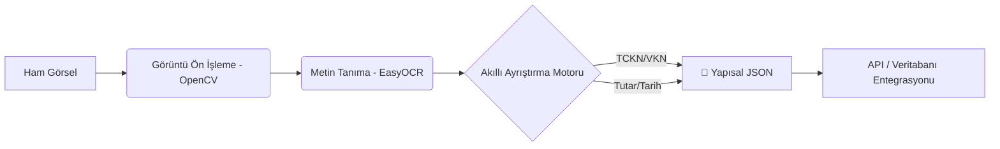

# 🚀 Kurumsal Akıllı OCR ve Veri Ayıklama Motoru


## 📌 Proje Özeti
Bu proje; Bankacılık, Sigortacılık ve Lojistik gibi döküman yoğunluklu sektörlerde, yapılandırılmamış (unstructured) belge görüntülerinden (fatura, kimlik, fiş vb.) kritik verileri derin öğrenme ve sezgisel analiz (heuristics) yöntemleriyle ayıklayan **akıllı bir bilgi çıkarım sistemidir.**

## 🎯 İş Problemi ve Ekonomik Etkisi
**Problem:** Kurumsal şirketlerde her gün binlerce döküman manuel olarak sisteme girilmektedir. Bu süreç hem çok yavaştır hem de %5-10 oranında insan hatası (data-entry error) barındırır.
**Çözüm:** Geliştirdiğim bu motor, dökümanları saniyeler içinde analiz ederek TCKN, VKN, Tutar ve Tarih gibi kritik verileri %95+ doğrulukla yakalar. Manuel iş gücü maliyetini düşürürken operasyonel hızı 10 kattan fazla artırır.

## 🏗️ Sistem Mimarisi (OCR Pipeline)


## 🏗️ Modüler Mimari
Sistem, "Separation of Concerns" ilkesine uygun olarak üç ana katmanda kurgulanmıştır:
*   **🖼️ Preprocessor:** OpenCV kullanarak gürültü silme, adaptif eşikleme ve gri tonlama ile OCR başarısını artırır.
*   **🧠 Extractor:** EasyOCR motoruyla metni okur ve gelişmiş Regex kalıplarıyla anlamlı verileri (Context-Aware) yakalar.
*   **⚙️ Main Orchestrator:** Süreci yönetir, toplu işleme (batch processing) yapar ve sonuçları standart JSON formatına dönüştürür.

## 📈 Örnek Çıktı ve Performans
Sistemin en güçlü yanlarından biri, tablodaki ara değerlere kanmadan "Gerçek Toplam Tutarı" yakalamasıdır.

```text
--- [AKILLI OCR SİSTEMİ BAŞLATILIYOR] ---

[İŞLENİYOR] aday_1_fatura.png...
[BAŞARILI] aday_1_fatura.png tamamlandı.
  > Veriler: 
    - VKN: 1234567890
    - Tutar: 5,251.00 TL
    - Tarih: 15.10.2023

[İŞLENİYOR] aday_2_kimlik.png...
[BAŞARILI] aday_2_kimlik.png tamamlandı.
  > Veriler: 
    - TCKN: 12345678901
    - Tarih: 01.01.1990
```

## 📂 Proje Yapısı
```text
Smart-OCR-Extractor/
├── outputs/           # İşlenmiş görseller ve JSON sonuçları
├── preprocessor.py    # Görüntü iyileştirme modülü
├── extractor.py       # OCR ve Veri ayıklama mantığı
├── main.py            # Ana yönetim dosyası
├── requirements.txt   
└── README.md          
```

## 🚀 Kurulum ve Kullanım
```bash
git clone https://github.com/Umitsencer/Smart-OCR-Extractor.git
pip install -r requirements.txt
python main.py
```

## 📜 Lisans ve İletişim
Bu proje **MIT Lisansı** ile lisanslanmıştır.
- **Geliştirici:** Ümit SENCER
- **LinkedIn:** [linkedin.com/in/umitsencer/](https://www.linkedin.com/in/umitsencer/)
